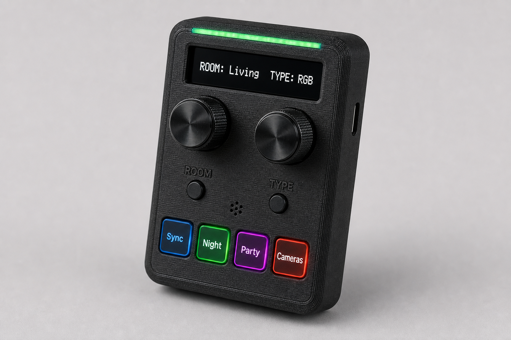
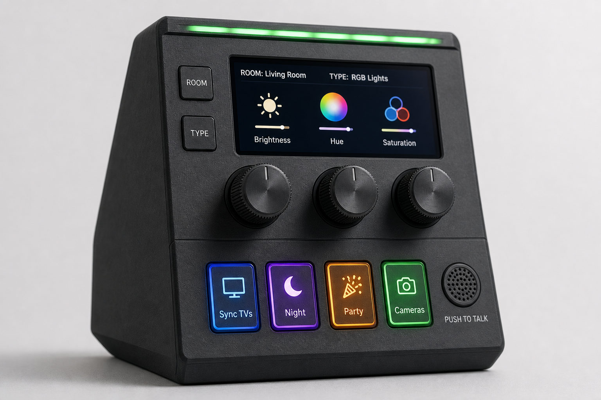
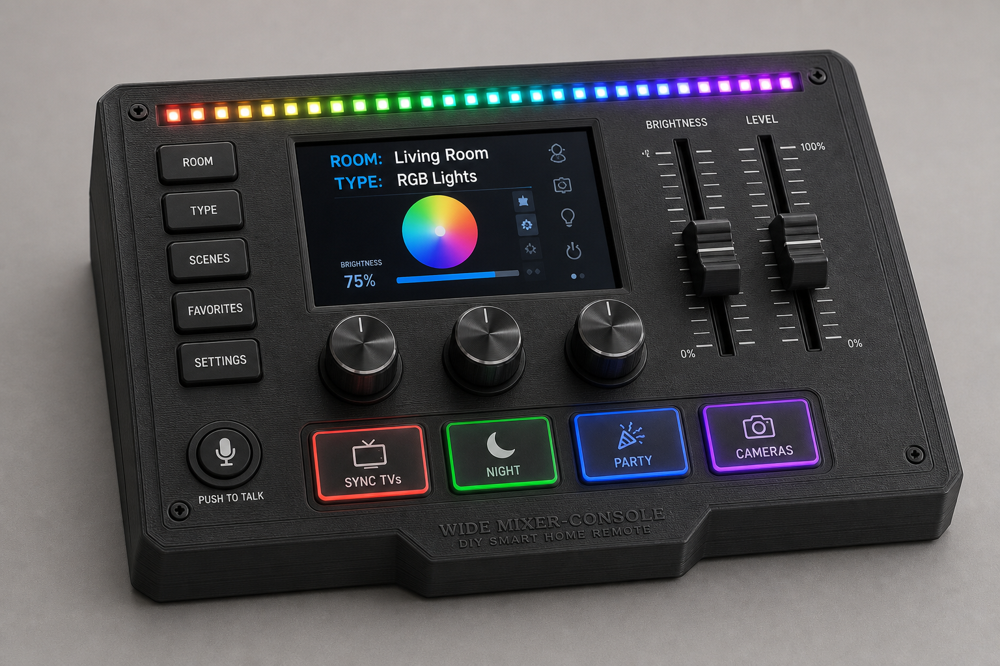
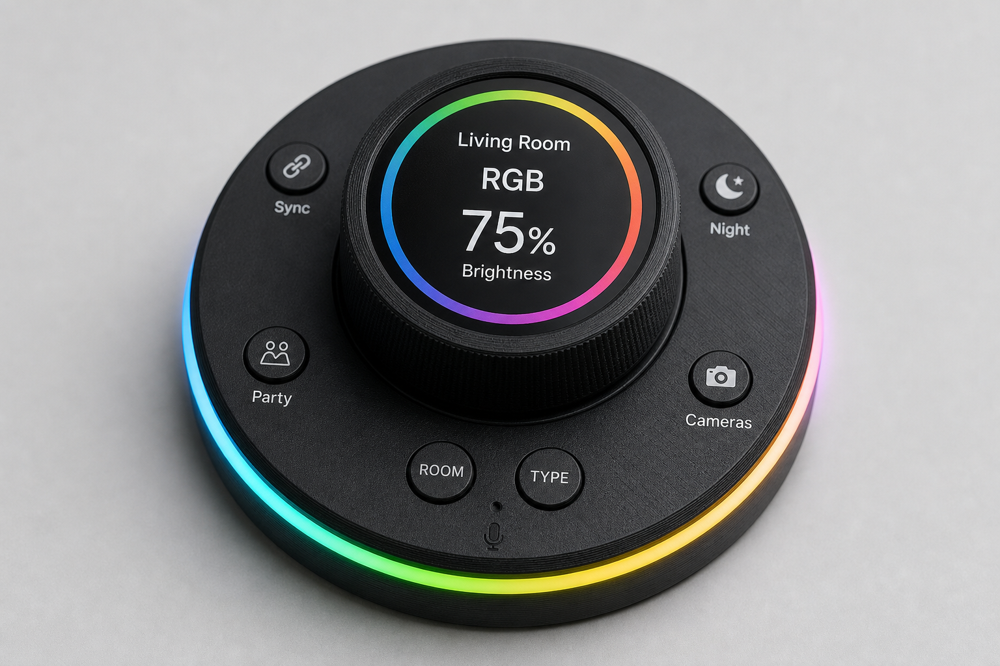
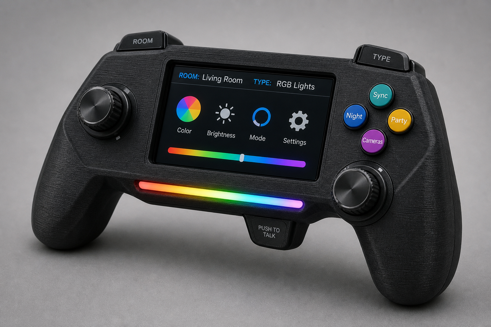
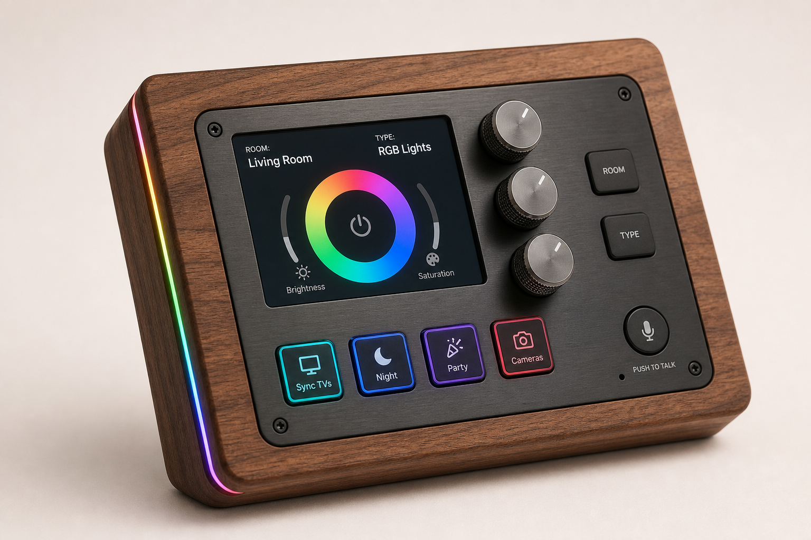

# Solutions — Unified Physical Remote (DIY Control Deck)

**Problem (P5):** A handheld, **battery-powered** physical controller that fires **custom actions** (automation scenes, TV/audio macros, lights) with **tactile switches, dials, sliders, and buttons**, **status LEDs**, an optional **screen**, and **voice input**.

**Constraints & assets:**
- May or may not include a screen (backlit, RGB array, minimal LCD, or combinations).
- **Status LEDs:** power/automation state, action success/failure.
- Physical **switches, dials (rotary encoders/pots), sliders (faders), buttons** are desired.
- **Reusable dials:** a small set of dials whose function changes with the selected **menu context** (not one dedicated dial per function).
- **3D printer + label maker** available; **electronics skills + custom wiring** are fine.
- **Night-viewable**, but lights/screens can **dim and sleep**.
- **Battery powered**; fits **one or two hands**; size is flexible — **features and cost** matter more.
- **Voice input** wanted.

**Required menus:**
- **Room:** Living Room / Bedroom
- **Type:** RGB Lights / Ceiling Lights
- **Automation:** Sync TVs / Night Time / Party Time / Cameras On

> This project lives mostly on the **ESP / ESPHome rail** and talks to the same **automation hub** as the lights/TV/audio (see [02-shared-architecture.md](./02-shared-architecture.md)). The remote is essentially a *physical front-end* for the macros defined in [solutions-03-home-control.md](./solutions-03-home-control.md). Six rendered build directions are presented at the end of this document.

---

## Interaction model — reusable dials + menus

The defining idea: a **few physical dials are reused**, and their meaning is set by the current **Room → Type** context shown on the screen. This keeps the device small while controlling many targets. **Automation** is a separate, context-independent list of one-shot scenes.

### Menu tree

```
HOME
├─ ROOM ........... Living Room | Bedroom          (sets WHERE the dials act)
├─ TYPE ........... RGB Lights  | Ceiling Lights   (sets WHAT the dials act on)
│      └─► reusable dials operate on the selected (Room + Type) target
└─ AUTOMATION ..... Sync TVs | Night Time | Party Time | Cameras On
                    (one-tap scripts; ignore Room/Type context)
```

### How "reusable" works

- **Selectors set context:** pick a **Room** and a **Type** (via dedicated buttons, a selector encoder, or the on-screen menu). The screen shows the active context and re-labels each dial ("soft labels").
- **Reusable parameter dials** then act on that target. The **same 2–3 encoders** mean different things per context:

| Context (Room + Type) | Dial 1 | Dial 2 | Dial 3 | Dial press |
|-----------------------|--------|--------|--------|-----------|
| **RGB Lights** | Brightness | Hue / color | Saturation / effect | Toggle on/off |
| **Ceiling Lights** *(non-dimmable, on/off only — Rail 3)* | Select fixture/group | — | — | Toggle on/off |

> Note: the **ceiling lights are non-dimmable on/off** (smart switch / Shelly relay — see [02-shared-architecture.md](./02-shared-architecture.md)). In that context the dials don't dim; Dial 1 scrolls the fixture/group and the press toggles it. RGB strips (IR→Broadlink or swapped to Zigbee/WLED) are the dimmable/color targets.

### Automation actions (context-independent)

| Button / menu item | Fires (hub) | Touches |
|--------------------|-------------|---------|
| **Sync TVs** | `play_media`/cast the same source to both Vizios; set living-room volume via Broadlink | Screen share |
| **Night Time** | Lights off/dim, lower audio, arm cameras, screens → sleep | Hub + lights + security |
| **Party Time** | RGB scene + color loop, audio group on, brighten | RGB lights + audio |
| **Cameras On** | Enable Frigate recording / arm detection + notify | Security |

Automation is best mapped to **4 dedicated backlit buttons** (instant, glanceable RGB state) rather than buried in a menu — so the reusable dials stay focused on Room/Type adjustment.

### Recommended control allocation (Solution A)

| Physical control | Role |
|------------------|------|
| **ROOM** button (or selector encoder) | Cycle Living Room ↔ Bedroom |
| **TYPE** button | Cycle RGB ↔ Ceiling |
| **3× reusable encoders** | Context-driven (table above); press to toggle |
| **4× RGB buttons** | Automation: Sync TVs, Night, Party, Cameras |
| **Push-to-talk button + mic** | Voice fallback for anything not on a dial |
| **WS2812 status strip** | Power, "sent", success/failure, hub-reachable |

Because the dials are now **soft-labeled**, a **screen becomes recommended (not optional)** for this model — a 1.3" OLED is enough; a small IPS TFT is nicer for color/room icons.

---

## Connectivity & feedback architecture

### Principle: the remote is a thin Wi‑Fi client

The remote **never talks to TVs or lights directly**. It speaks **one protocol — Wi‑Fi to the automation hub** (ESPHome native API) — and the hub fans out to each device on its native rail. This keeps firmware simple and is what makes real feedback possible.

```
Remote ──Wi-Fi (ESPHome native API, TCP/acked)──► Automation hub ──┬─ IP/Cast ──► Vizio V4K65M-08, Chromecast 4K
                                                                    ├─ Wi-Fi→IR ─► Broadlink ──IR──► Samsung audio, 3 IR light zones
                                                                    └─ Zigbee/Wi-Fi ► ceiling smart switches / WLED
```

### How it reaches each target

| Target | Transport | Path | Notes |
|--------|-----------|------|-------|
| **V4K65M-08** (living room) | **Wi‑Fi / IP** | Remote→hub `vizio` + `cast` | No BT, no IR needed for the TV itself |
| **Chromecast 4K** (bedroom) | **Wi‑Fi / IP** | Remote→hub `cast` + `androidtv` (ADB) | App launch, play, volume |
| **Samsung sound system** | **IR** | Remote→hub→Broadlink RM4→IR | Volume/mute live here (ARC), not on the TV |
| **3 IR light zones** | **IR** | Remote→hub→Broadlink / ESPHome IR node→IR | Line-of-sight per zone |
| **Ceiling lights** | **Zigbee / Wi‑Fi** | Remote→hub→smart switch / Shelly | Two-way; on/off |

- **Skip Bluetooth.** Neither the Vizio nor the Chromecast exposes useful BT control; BT is one-host, short-range, and pairing-fragile. Wi‑Fi/IP is strictly better.
- **Keep IR centralized on the Broadlink**, not on the remote. (An optional on-board IR LED only as an *offline* fallback — open-loop and duplicates the blaster.)

### Feedback — two layers

| Layer | Always available? | Drives |
|-------|-------------------|--------|
| **1. Command delivery** | **Yes** — ESPHome native API is TCP and **acknowledged** | blue = sent · green = script ran · red = failed/timeout · amber = hub unreachable |
| **2. Actual device state** | **Only on two-way rails** | True values imported from hub entities |

- **Two-way devices** (Cast TVs, Vizio API, Zigbee switches, WLED): the hub holds real state; the deck **imports it** via the ESPHome `homeassistant` sensor/`text_sensor` and shows true values. Closed loop.
- **One-way IR devices** (Samsung audio, IR strips): IR is **fire-and-forget**. To truly close the loop, **add a sensor**:
  - A **power-monitoring smart plug** on the Samsung system / IR-light supply → watts rise = actually on.
  - Or **swap the IR strip controller to Zigbee/WLED** for native state (best).
  - Otherwise the hub tracks **assumed/optimistic** state — signal it as "assumed," not "confirmed."

### Expanded status-LED array (one LED per zone)

Dedicate **one addressable RGB LED per tracked entity** for at-a-glance state. For **open-loop IR devices, back the LED with a power sensor** so it reflects *measured reality*.

| LED | Tracks | Off / Idle | On / OK | Problem |
|-----|--------|-----------|---------|---------|
| LR RGB | living-room strip | dim | color of strip | red = unreachable |
| Ceiling | ceiling switch | dim | white | — |
| Samsung audio | power-sense plug | dim | green | amber = assumed (no sensor) |
| Cameras | Frigate armed | dim | green | red = recording error |
| Sync | TVs casting | dim | blue | amber = one TV only |
| Hub link | API connection | — | green | amber/red = offline |

### On-screen action descriptions (toast + log)

The screen shows **transient per-step results** so IR failures aren't silent:

```
Night Time
  ✓ 6 lights off
  ✓ cameras armed
  ⚠ Samsung audio (assumed — no sensor)
```

**Division of labor:** LEDs = persistent at-a-glance zone state; screen = transient narrative + values + error detail.

**Battery caveat:** more always-on RGB costs runtime — keep LEDs **dim, low brightness, and auto-sleeping with the screen**. A handful at low duty is negligible; dozens at full brightness will hurt.

### Feedback sketch (ESPHome ↔ hub)

```yaml
# Import a real hub entity state so the deck reflects truth (two-way devices)
text_sensor:
  - platform: homeassistant
    id: lr_rgb_state
    entity_id: light.living_room_rgb     # "on"/"off" + attributes

# For IR devices, import a power-sensing plug instead of trusting the IR send
sensor:
  - platform: homeassistant
    id: samsung_watts
    entity_id: sensor.samsung_audio_power # >5 W ⇒ actually on
```

The hub pushes these to the deck; an on-device automation maps them to the per-zone LEDs and the on-screen log.

---

## Solution A — ESP32-S3 + ESPHome custom deck (recommended)

| | |
|---|---|
| **What it is** | A custom board (perfboard → custom PCB) around an **ESP32‑S3**: mechanical/arcade **buttons**, **rotary encoders** (dials), **slide pots** (faders), toggle **switches**, **WS2812 RGB** status LEDs, optional **OLED/TFT**, **I²S mic** (INMP441) for voice, **LiPo + charger**. Runs **ESPHome**; native hub API. |
| **Voice** | ESPHome **Voice Assistant** with on-device **microWakeWord**; audio streams to **HA Assist** (Whisper STT + intents). **Push‑to‑talk** button strongly recommended to protect battery. |
| **Custom actions** | Each control maps to an ESPHome automation → hub service call (scene, script, `media_player`, IR/Broadlink). **Reusable dials** read the current Room/Type context (global vars) and call the matching service. |
| **Status LEDs** | WS2812: a "command" strip (sent/success/failure/hub-link) **plus a per-zone LED array** (one LED per tracked entity — LR RGB, ceiling, Samsung audio, cameras, sync) driven by real hub state / power sensors. See *Connectivity & feedback*. |
| **Screen** | **Recommended** for this build (soft dial labels + context): 1.3" OLED (low power) or a small IPS TFT for room/type icons and live values. |
| **Battery** | 18650 or LiPo pouch 2000–3500 mAh; **deep sleep** wake-on-touch/button; weeks of standby, ~1–2 days if always-listening. |
| **Cost** | **~$45–95** in parts (see BOM). |

**Capabilities**
- Fully local control via the hub API/MQTT; OTA firmware.
- **Reusable encoders** re-mapped by Room/Type context; faders for fine levels; toggles/buttons for modes and Automation.
- Per-button RGB + on-screen soft labels; label maker for static legends (ROOM, TYPE, automation names).

**Tradeoffs**

| Pros | Cons |
|------|------|
| Native hub, no cloud; cheap; infinitely customizable | You design power/sleep + wiring |
| Reuses electronics + 3D-printing skills | Always-on voice wake word drains battery → use push-to-talk |
| Status feedback loop (success/fail LEDs) | ESPHome voice is good but server-side STT needs HA Assist set up |

**Technical fit:** Best balance of cost, control, and hub-native integration. **Primary recommendation.**

---

## Solution B — M5Stack modular (Core2 / Dial / Cardputer + units)

| | |
|---|---|
| **What it is** | Off-the-shelf **ESP32** maker modules with **screen + battery** built in: **M5Dial** (rotary + round LCD), **Core2** (touch LCD), **Cardputer** (keyboard); add mic/IR/button units. Flash **ESPHome** or M5 firmware. |
| **Voice** | M5 mic unit + ESPHome voice, or echo-style modules. |
| **Cost** | **~$30–120** depending on modules. |

**Tradeoffs**

| Pros | Cons |
|------|------|
| Battery/screen/enclosure already solved | Less tactile (few real dials/faders) |
| Fast to a working prototype | Fixed form factor; fewer physical controls |
| ESPHome-compatible | Modules add up in cost |

**Technical fit:** Fast path / prototype before committing to a custom PCB; or for a screen-first device with minimal soldering.

---

## Solution C — Stream Deck + Companion (desk reference, not the spec)

| | |
|---|---|
| **What it is** | Elgato Stream Deck (LCD keys) + **Bitfocus Companion** → hub. |
| **Cost** | **$80–250**. |

**Tradeoffs**

| Pros | Cons |
|------|------|
| Polished LCD buttons; reliable | **USB-wired, no battery**, **no voice**, no dials/faders |
| Zero firmware work | Doesn't meet the battery/voice/tactile goals |

**Technical fit:** A wired control surface for a desk — listed for completeness; **fails the battery/voice/handheld requirements.**

---

## Solution D — FreeTouchDeck / ESP32 "Cheap Yellow Display" (touch-first)

| | |
|---|---|
| **What it is** | ESP32 + TFT touchscreen (CYD ~$15) running **FreeTouchDeck**/ESPHome; soft buttons + a few hardware buttons/encoders bolted on. |
| **Cost** | **~$20–50**. |

**Tradeoffs**

| Pros | Cons |
|------|------|
| Cheapest screen-based deck | Touch ≠ tactile dials/faders |
| Good for icon grids | Battery/power must be added |

**Technical fit:** Touch-centric, low cost; combine with a few real encoders for tactile feel.

---

## Solution E — QMK/ZMK macropad (mechanical-keyboard rail)

| | |
|---|---|
| **What it is** | A custom **mechanical** controller using **ZMK** (wireless BLE) or **QMK** (USB): Cherry-MX switches, rotary encoders, OLED, per-key RGB. ZMK gives **battery + BLE**. Bridges to the hub via a host/BLE-HID receiver or companion. |
| **Cost** | **~$60–200** (nice switches/PCB). |

**Tradeoffs**

| Pros | Cons |
|------|------|
| Best mechanical feel; mature RGB/OLED/encoder support | HID-centric → needs a bridge to reach the hub cleanly |
| ZMK = great battery life | No native voice; faders/sliders less common |

**Technical fit:** If keyboard-grade switch feel matters most and you accept a HID→hub bridge.

---

## Solution F — Raspberry Pi handheld (max compute / offline voice)

| | |
|---|---|
| **What it is** | Pi Zero 2 W / Pi 4 + touchscreen + GPIO controls; can run **offline** wake word + local STT, full apps. |
| **Cost** | **~$60–150**. |

**Tradeoffs**

| Pros | Cons |
|------|------|
| Offline voice possible; powerful | Worse battery life, bulkier, hotter |
| Run anything (browser, RTSP preview) | Overkill for sending hub commands |

**Technical fit:** Only if on-device/offline voice or a rich in-hand screen UI is wanted.

---

## Voice input options (any solution)

| Approach | Where STT runs | Battery impact | Notes |
|----------|----------------|----------------|-------|
| **ESPHome VA + microWakeWord → HA Assist** | Hub server (Whisper) | Push‑to‑talk: low / Always‑on: high | Best hub-native path (Solution A/B/D) |
| **HA Voice PE / Atom Echo as a separate puck** | Hub server | n/a (own power) | Offload voice to a mains-powered satellite; the remote stays button-only |
| **On-device offline (Pi + whisper.cpp)** | On device | High | Only Solution F |

**Recommendation:** **push‑to‑talk** (a dedicated button starts streaming) — preserves battery and avoids false wakes. Consider a **separate always-listening voice puck** for the room so the handheld can sleep aggressively.

---

## Reference BOM — Solution A (rich tactile deck)

| Part | Qty | Unit $ | Total |
|------|-----|--------|-------|
| ESP32‑S3 dev board (PSRAM) | 1 | $10 | $10 |
| Rotary encoders w/ push | 3 | $1.50 | $5 |
| Slide potentiometers (faders) | 2 | $3 | $6 |
| Mechanical/arcade buttons | 8 | $1 | $8 |
| Toggle/rocker switches | 3 | $1 | $3 |
| WS2812 RGB (command strip + per-zone array) | 18–24 px | — | $5 |
| Power-sensing smart plug *(external/optional — closes IR loop)* | 1–2 | $12 | +$12–24 |
| 1.3" OLED (SSD1306/SH1106) | 1 | $5 | $5 |
| INMP441 I²S mic | 1 | $4 | $4 |
| LiPo 3500 mAh + TP4056 + boost | 1 | $14 | $14 |
| 3D-printed shell + filament | — | — | $4 |
| Misc (wire, headers, screws) | — | — | $5 |
| **Total (handheld)** | | | **~$69** |

The **power-sensing plug(s)** live in the hub (not in the handheld) and are **optional** — they exist to close the feedback loop on the one-way IR devices (Samsung audio, IR strips). Add a small **IPS TFT** (+$8) instead of OLED for color labels; subtract faders/encoders to cut cost toward ~$45.

---

## Wiring & GPIO pinout (Solution A, ESP32‑S3‑WROOM‑1)

> This is the **authoritative** mapping (the rendered diagrams are visual references only). Pins are chosen to avoid strapping pins (0, 3, 45, 46), USB (19/20), UART debug (43/44), and octal-PSRAM pins (26–32 on N16R8 modules).

### Pin map

| Function | Signal | GPIO | Notes |
|----------|--------|------|-------|
| **Encoder 1** | A / B / SW | 4 / 5 / 6 | `INPUT_PULLUP`; SW = push |
| **Encoder 2** | A / B / SW | 7 / 15 / 16 | |
| **Encoder 3** | A / B / SW | 17 / 18 / 8 | |
| **ROOM button** | SW | 9 | pull-up |
| **TYPE button** | SW | 10 | pull-up |
| **Automation btns ×4** | SW | 11 / 12 / 13 / 14 | Sync / Night / Party / Cameras |
| **Push-to-talk** | SW | 21 | wakes the mic stream |
| **WS2812 (command + zone array)** | DIN | 38 | 5 V data; level-shift if noisy |
| **INMP441 mic (I²S)** | BCLK / WS / SD | 40 / 41 / 42 | SEL→GND (left ch) |
| **Display (ST7789 SPI)** | SCLK / MOSI / CS / DC / RST / BLK | 36 / 35 / 34 / 33 / 47 / 48 | OLED users: swap to I²C SDA=8 / SCL=9 and free encoder pins |
| **Battery sense** | ADC | 1 | ADC1_CH0 via 2×100 kΩ divider |

### Power subsystem

```
USB-C ──► TP4056/IP5306 charger ──► LiPo 3.7V 3500 mAh ──► 3.3 V LDO/buck ──► ESP32-S3 3V3
                                          │
                                          └► ADC divider ──► GPIO1 (battery %)
WS2812 + INMP441 run on 3V3 (or 5V boost for the LED strip; common GND with the ESP32)
```

- **Common ground** across the ESP32, encoders, buttons, mic, LEDs, and charger.
- WS2812 are happiest at 5 V; at 3.3 V data they usually work for a short run — add a **74AHCT125 level shifter** if you see flicker on the longer zone array.
- Use **deep sleep + wake-on-interrupt** (PTT/ROOM button on an RTC-capable pin) for battery life.

### Logical wiring overview

```
                 ┌───────────────────────────┐
   3× Encoders ──┤ GPIO4-8,15-18             │
 ROOM/TYPE btn ──┤ GPIO9,10                  │
 4× Auto btns  ──┤ GPIO11-14                 │
   PTT button  ──┤ GPIO21          ESP32-S3  │── Wi-Fi ──► Automation hub
  WS2812 array ──┤ GPIO38 (DIN)              │
   INMP441 mic ──┤ GPIO40-42 (I²S)           │
  ST7789 TFT   ──┤ GPIO33-36,47,48 (SPI)     │
  Batt divider ──┤ GPIO1 (ADC)               │
                 └──────────┬────────────────┘
                            │ 3V3 / GND
            USB-C ─► TP4056 ─► LiPo ─► LDO/buck
```

---

## Reusable-dial context (ESPHome sketch)

```yaml
# Two globals hold the current menu context
globals:
  - id: room          # 0 = Living Room, 1 = Bedroom
    type: int
    restore_value: yes
  - id: light_type    # 0 = RGB, 1 = Ceiling
    type: int

# ROOM / TYPE selector buttons cycle the context and refresh the screen
binary_sensor:
  - platform: gpio
    pin: GPIO5
    name: "Sel Room"
    on_press:
      - lambda: 'id(room) = (id(room) + 1) % 2;'
      - component.update: deck_display

  - platform: gpio
    pin: GPIO6
    name: "Sel Type"
    on_press:
      - lambda: 'id(light_type) = (id(light_type) + 1) % 2;'
      - component.update: deck_display

# Reusable Dial 1 = Brightness/Hue (RGB) or fixture-select (Ceiling)
sensor:
  - platform: rotary_encoder
    id: dial1
    pin_a: GPIO7
    pin_b: GPIO8
    on_clockwise:
      - homeassistant.event:
          event: esphome.deck_dial
          data:
            dial: "1"
            dir: "up"
            room: !lambda 'return id(room);'
            type: !lambda 'return id(light_type);'
```

The hub then routes `esphome.deck_dial` with a `choose:` on `room`/`type` to the right target (RGB `light.turn_on` brightness/hue vs. ceiling group/fixture toggle). The screen (`deck_display`) renders the live soft labels for each dial.

---

## Status-LED + success/failure pattern (ESPHome ↔ hub)

```yaml
# ESPHome: button press → hub event; hub replies with result → LED feedback
binary_sensor:
  - platform: gpio
    pin: GPIO4
    name: "Deck Btn SyncTVs"
    on_press:
      - homeassistant.event:
          event: esphome.deck_action
          data: {action: "sync_tvs"}   # Automation buttons ignore Room/Type

# In the hub: a script runs, then sets a text/RGB helper the deck subscribes to:
# light.turn_on deck_status → green flash on success, red on failure (choose/try)
```

LED states: **dim idle**, **blue pulse = sent**, **green = success**, **red = failure/timeout**, **amber = hub unreachable**.

---

## Solution comparison matrix

| Solution | Tactile (dials/faders) | Screen | Voice | Battery-native | Hub-native | Build effort | Cost |
|----------|------------------------|--------|-------|----------------|------------|--------------|------|
| A ESP32‑S3 ESPHome | ★★★★★ | optional | ★★★★ (PTT) | ★★★★ | ★★★★★ | High | $45–95 |
| B M5Stack | ★★ | ★★★★★ | ★★★★ | ★★★★★ | ★★★★ | Low | $30–120 |
| C Stream Deck | ✗ | ★★★★★ | ✗ | ✗ | ★★★★ | Very low | $80–250 |
| D FreeTouchDeck/CYD | ★★ | ★★★★ | ★★★ | ★★ | ★★★★ | Low–Med | $20–50 |
| E QMK/ZMK | ★★★★★ | ★★★ | ✗ | ★★★★ (ZMK) | ★★ (bridge) | Med–High | $60–200 |
| F Raspberry Pi | ★★★ | ★★★★ | ★★★★★ (offline) | ★★ | ★★★ | Med | $60–150 |

---

## Recommended path

1. **Prototype on M5Stack/CYD** (Solution B/D) to validate the **Room/Type context + reusable dials** and the voice flow quickly (~a weekend); the screen makes this model easy to test before soldering.
2. **Build Solution A** as the keeper: ESP32‑S3 + **3 reusable encoders** + **ROOM/TYPE selector buttons** + **4 Automation RGB buttons** + push‑to‑talk + WS2812 + OLED/TFT + I²S mic + 3500 mAh LiPo, a 3D-printed shell, and label-maker legends.
3. **Voice = push‑to‑talk** to HA Assist; optionally add a mains-powered **voice puck** so the handheld sleeps.
4. **Power discipline:** deep sleep + wake-on-interrupt; USB-C charging; an LED/OLED auto-dim schedule for night.
5. **Feedback loop:** wire success/failure RGB from hub script results so every action confirms physically.

**Maintenance:** OTA ESPHome updates; recharge weekly (or per-use if voice-heavy); re-map buttons in YAML as scenes evolve.

---

## Scored recommendation

**Top pick — ESP32‑S3 + ESPHome custom deck (with push‑to‑talk voice).** A custom board with real tactile controls, WS2812 status LEDs (success/failure feedback), an optional OLED, an I²S mic for **push‑to‑talk** voice → HA Assist, and a LiPo with deep sleep. Native hub, fully owned.

| Dimension | Assessment |
|-----------|------------|
| **Cost range** | **$45–95** parts (ESP32‑S3 $10, 3 encoders $5, 2 faders $6, 8 buttons $8, WS2812 $4, OLED $5, I²S mic $4, LiPo+charger $14, printed shell + misc $9). TFT screen +$8. |
| **Setup time** | **2–4 days** (wiring/soldering, ESPHome YAML, enclosure print/iterate, voice + LED feedback). |
| **Maintenance** | **Low–Med** — OTA firmware; recharge weekly (or per-use if voice-heavy); re-map buttons as scenes evolve. |
| **Feasibility** | ★★★★★ — an ideal match for the household's skills/tools; the one risk is **always-on voice battery drain** → use push‑to‑talk. |
| **Scalability** | ★★★★★ — add controls/pages/LEDs in YAML; build multiples for other rooms; same firmware pattern. |

**Reuse:** pure **ESP/ESPHome rail** — the same toolchain as the **IR lights** (Home control) and **RFID readers** (RFID scenes). It's a **physical front-end for the hub macros** built for Home control and Screen share, and it can fire **IR (Broadlink) macros** and **Cast** actions. Voice reuses the **HA Assist** that the hub already provides.

**Alternate A — M5Stack / CYD prototype first.** Off-the-shelf ESP32 + screen + battery (M5Dial/Core2 or Cheap Yellow Display). Cost $20–120; setup ~a weekend; feasibility ★★★★★; scalability ★★★. Use it to **validate macros + the voice flow fast**, then graduate to the custom deck. Fewer real dials/faders.

**Alternate B — ZMK mechanical macropad.** Keyboard-grade switches, encoders, OLED, BLE + battery. Cost $60–200; feasibility ★★★★ (needs a HID→hub bridge); scalability ★★★★. Pick only if switch *feel* outranks hub-native simplicity and voice (no native voice).

**Verdict:** **Prototype on M5Stack/CYD** first, then build the **ESP32‑S3 ESPHome deck** as the keeper once the hub scenes are stable (build order last). Commit to **push‑to‑talk voice** and a real **success/failure LED loop** — that feedback is what makes a physical remote feel better than a phone. The cheapest high-craft project in the portfolio.

---

# Build concepts

Six **buildable** design directions, each implementing the spec above: **reusable dials** re-mapped by a **Room → Type** context, an **Automation** set (Sync TVs / Night / Party / Cameras On), **status LEDs** (power / success / failure), **push-to-talk voice**, and **battery** power.

**Common assumptions:** ESP32‑S3 + ESPHome, automation-hub API, USB‑C LiPo charging, a 3D-printed enclosure, label-maker legends. Prices are rough hobby-quantity USD and exclude tools and filament already on hand.

## Concept 1 — Pocket OLED (budget / one-handed)



Smallest, cheapest build: a monochrome OLED, **2 reusable dials**, and the 4 automation buttons. Context shown as text ("ROOM: Living  TYPE: RGB").

| Component | Part | Cost |
|-----------|------|------|
| MCU | ESP32‑S3 mini board | $7 |
| Screen | 0.96" OLED (SSD1306) | $4 |
| Reusable dials | 2× rotary encoder w/ push | $3 |
| Selectors | ROOM/TYPE tactile buttons | $1 |
| Automation | 4× tactile + 4× WS2812 | $4 |
| Status LED | WS2812 strip (6 px) | $2 |
| Voice | INMP441 I²S mic | $4 |
| Power | LiPo 1200 mAh + TP4056 | $9 |
| Enclosure | 3D print + hardware | $6 |
| **Total** | | **~$40** |

**Advantages** — cheapest and fastest to build; truly pocketable/one-handed; low power → longest standby on a small cell; a great first prototype to validate the Room/Type flow.
**Disadvantages** — monochrome text only (no color swatches or icons); only 2 dials → tighter mapping (e.g. brightness + hue, no separate saturation); cramped layout that leans on label-maker tags.

## Concept 2 — Standard TFT deck (recommended)



The balanced build and the one Solution A targets: a **1.9" IPS** screen with soft dial labels, **3 reusable encoders**, ROOM/TYPE selectors, 4 RGB automation buttons, and push-to-talk.

| Component | Part | Cost |
|-----------|------|------|
| MCU | ESP32‑S3 (8 MB PSRAM) | $10 |
| Screen | 1.9" IPS TFT (ST7789) | $9 |
| Reusable dials | 3× rotary encoder w/ push | $5 |
| Selectors | ROOM/TYPE buttons | $1 |
| Automation | 4× RGB arcade buttons | $6 |
| Status LED | WS2812 strip (12 px) | $4 |
| Voice | INMP441 I²S mic | $4 |
| Power | LiPo 3500 mAh + TP4056 + boost | $14 |
| Enclosure | 3D print + hardware | $9 |
| **Total** | | **~$62** |

**Advantages** — color soft-labels make reusable dials self-explanatory; 3 dials cleanly cover RGB brightness/hue/saturation; comfortable two-hand ergonomics; best all-round value.
**Disadvantages** — more wiring than the pocket build; no faders for very fine level control; mid battery; always-on voice still needs push-to-talk.

## Concept 3 — Mixer console (max controls)



A widescreen "control desk": adds **2 slide faders** alongside 3 encoders and extra selector buttons — for when you want a dedicated physical level for everything.

| Component | Part | Cost |
|-----------|------|------|
| MCU | ESP32‑S3 (8 MB PSRAM) | $10 |
| Screen | 2.4" IPS TFT | $12 |
| Reusable dials | 3× rotary encoder | $5 |
| Faders | 2× 60 mm slide pots | $8 |
| Selectors | 6–8 buttons (rooms/types/scenes) | $8 |
| Automation | 4× RGB buttons | $6 |
| Status LED | WS2812 strip (16 px) | $5 |
| Voice | INMP441 I²S mic | $4 |
| Power | LiPo 5000 mAh + charger + boost | $18 |
| Enclosure | larger 3D print + hardware | $12 |
| **Total** | | **~$88** |

**Advantages** — most simultaneous controls; faders give instant absolute levels; big battery → long runtime even with the larger screen; excellent for power-users / multi-room "scene mixing."
**Disadvantages** — largest, least portable (lives on a coffee table or desk); more parts = more soldering and more to go wrong; highest cost in the set.

## Concept 4 — Thermostat puck (single-dial)



Circular, **one large reusable dial** with a round color screen and an RGB rim. Minimalist; spin to adjust, edge buttons for automations.

| Component | Part | Cost |
|-----------|------|------|
| MCU | ESP32‑S3 | $10 |
| Screen | 1.28" round IPS (GC9A01) | $9 |
| Reusable dial | 1× quality rotary encoder | $6 |
| Selectors | ROOM/TYPE + 4 edge buttons | $4 |
| Status LED | WS2812 ring (16–24 px) | $6 |
| Voice | INMP441 I²S mic | $4 |
| Power | LiPo 2000 mAh + TP4056 | $10 |
| Enclosure | round 3D print + hardware | $8 |
| **Total** | | **~$57** |

**Advantages** — cleanest aesthetic; sits nicely on a side table; one-dial interaction is intuitive (thermostat-like); the RGB rim is a beautiful glanceable status indicator.
**Disadvantages** — single dial → more menu-stepping to reach each parameter; the round screen wastes corner space and is fiddly to lay out; less tactile variety (no faders/toggles).

## Concept 5 — Game grip (ergonomic, two-thumb)



Controller form with a **dial under each thumb**, shoulder ROOM/TYPE buttons, and face buttons for automations. Best in-hand ergonomics for couch use.

| Component | Part | Cost |
|-----------|------|------|
| MCU | ESP32‑S3 | $10 |
| Screen | 3.0" IPS TFT | $14 |
| Reusable dials | 2× thumb rotary encoders | $4 |
| Selectors | 2 shoulder + 4 face buttons | $5 |
| Status LED | WS2812 light bar (10 px) | $4 |
| Voice | INMP441 I²S mic | $4 |
| Power | 4000 mAh LiPo + charger + boost | $16 |
| Enclosure | ergonomic 3D print (more filament) | $14 |
| **Total** | | **~$71** |

**Advantages** — most comfortable for long couch sessions; natural thumb reach; big screen + light bar (great for the "Sync TVs / movie" use case); buttons + dials within reach without looking.
**Disadvantages** — bulkiest enclosure; most print time and iteration to get the grips right; only 2 dials (relies on menu context switching); heaviest to hold one-handed.

## Concept 6 — Premium wood (showpiece)



A display-worthy build: walnut shell, brushed-aluminum faceplate, machined knobs. Same electronics as the standard deck, elevated finish.

| Component | Part | Cost |
|-----------|------|------|
| MCU | ESP32‑S3 (8 MB PSRAM) | $10 |
| Screen | 2.4" IPS TFT | $12 |
| Reusable dials | 3× encoder + machined alu knobs | $14 |
| Selectors | ROOM/TYPE buttons | $2 |
| Automation | 4× RGB buttons | $6 |
| Status LED | WS2812 strip (12 px) | $4 |
| Voice | INMP441 I²S mic | $4 |
| Power | LiPo 3500 mAh + charger + boost | $14 |
| Enclosure | walnut blank + finish + 3D parts | $20 |
| Misc | hardware, threaded inserts | $6 |
| **Total** | | **~$92** |

**Advantages** — looks like a finished consumer product; living-room friendly; premium knob feel; a metal faceplate is durable; same proven electronics as Concept 2 (low technical risk).
**Disadvantages** — most expensive; woodworking adds time and tools; wood/metal complicate antenna placement (keep the ESP32 antenna near a non-metal window); repairs/mods are harder once finished.

## Concept feature comparison

| Feature | 1 Pocket | 2 Standard ⭐ | 3 Mixer | 4 Puck | 5 Grip | 6 Wood |
|---------|:--------:|:------------:|:-------:|:------:|:------:|:------:|
| **Cost (parts)** | ~$40 | ~$62 | ~$88 | ~$57 | ~$71 | ~$92 |
| **Screen** | 0.96" OLED mono | 1.9" IPS | 2.4" IPS | 1.28" round | 3.0" IPS | 2.4" IPS |
| **Reusable dials** | 2 | 3 | 3 | 1 (large) | 2 (thumb) | 3 |
| **Faders** | – | – | 2 | – | – | – |
| **Automation buttons** | 4 | 4 | 4 | 4 (edge) | 4 (face) | 4 |
| **Voice (PTT)** | ✓ | ✓ | ✓ | ✓ | ✓ | ✓ |
| **Status LEDs** | 6 px | 12 px | 16 px | ring | bar | 12 px |
| **Battery** | 1200 mAh | 3500 mAh | 5000 mAh | 2000 mAh | 4000 mAh | 3500 mAh |
| **Est. standby** | weeks | ~2–3 wk | ~3–4 wk | ~2 wk | ~3 wk | ~2–3 wk |
| **Ergonomics** | 1-hand | 2-hand | desk | table | 2-hand couch | 2-hand/desk |
| **Build effort** | Low | Medium | High | Medium | High | High |
| **Portability** | ★★★★★ | ★★★★ | ★★ | ★★★★ | ★★★ | ★★★ |
| **Tactile variety** | ★★ | ★★★★ | ★★★★★ | ★★ | ★★★ | ★★★★ |
| **Aesthetic / fit** | ★★ | ★★★ | ★★★ | ★★★★★ | ★★★ | ★★★★★ |
| **Best for** | First build / EDC | Daily driver | Power user | Side table | Couch / TV | Showpiece |

⭐ = recommended starting point. A common path: prototype on **Concept 1**, build **Concept 2** as the daily driver, then re-shell as **Concept 6** for a showpiece finish.

Runtime estimates assume push-to-talk voice and deep-sleep with wake-on-interrupt; an always-listening wake word reduces these to ~1–2 days regardless of concept.

---

## Full dossier — recommended build (Solution A, Standard TFT deck)

### Concept image

The six rendered build directions are shown above under **Build concepts** (`./assets/collection-1-pocket.png` … `collection-6-wood.png`). Concept 2 (Standard TFT deck) is the recommended starting form factor.


### Parts list

See the itemized **Reference BOM — Solution A** above (~$69 handheld; +$8 for a color TFT instead of OLED; optional power-sensing plug $12–24 lives in the hub, not the deck). The six concepts each carry their own component cost breakdown.

### Cost example

- **Pocket prototype (Concept 1):** ~**$40**.
- **Daily driver (Concept 2 / Solution A):** ~**$62–70** (TFT + 3 encoders + 4 RGB buttons + mic + 3500 mAh LiPo).
- **Showpiece re-shell (Concept 6):** ~**$92** (same electronics, walnut/aluminum).
- **Optional IR-loop closure:** +**$12–24** for 1–2 hub-side power-sensing plugs.

### Data path

See **Connectivity & feedback architecture** above. In short: the deck is a thin Wi‑Fi client → **ESPHome native API (TCP, acknowledged)** → **Home Assistant**, which fans out on each rail (IP/Cast to TVs, Wi‑Fi→IR via Broadlink to Samsung/IR lights, Zigbee to ceiling switches). Real device state and power-sensor readings flow back to drive the per-zone LEDs and on-screen log.

### General wiring / topology diagram

See **Wiring & GPIO pinout (Solution A)** above — authoritative ESP32‑S3 pin map, the power subsystem (USB‑C → TP4056 → LiPo → 3V3 + ADC divider), and the logical wiring overview. Reproduced briefly:

```
   3× Encoders ─ GPIO4-8,15-18 ┐
 ROOM/TYPE btn ─ GPIO9,10       │
 4× Auto btns  ─ GPIO11-14      ├─ ESP32-S3 ── Wi-Fi ──► Home Assistant
   PTT button  ─ GPIO21         │
  WS2812 array ─ GPIO38         │
   INMP441 mic ─ GPIO40-42 (I²S)│
  ST7789 TFT   ─ GPIO33-36,47,48┘
   USB-C ─► TP4056 ─► LiPo 3500mAh ─► LDO/buck ─► 3V3
```

### Effort to create

| Phase | Effort |
|-------|--------|
| Prototype on M5Stack/CYD: validate Room/Type context + voice flow | ~1 weekend |
| Solder board, wire encoders/buttons/LEDs/mic, fit power | 0.5–1 day |
| ESPHome YAML: globals, dial routing, LED/feedback, voice | 0.5–1 day |
| 3D-print + iterate enclosure; label-maker legends | 0.5–1 day |
| **Total (keeper build)** | **~2–4 days** |

### Maintenance cost

- **Electricity:** negligible — USB‑C recharge **weekly** (or per-use if voice-heavy); a few cents/yr.
- **Time:** OTA ESPHome updates + occasional button re-mapping as scenes evolve ≈ **15–30 min/mo**.
- **Parts:** LiPo cell replacement every **2–3 yrs** (~$8); the rest is long-lived.
- **Subscriptions:** none (voice runs on the local HA Assist server).

### Cost feasibility & scalability

- **Per-additional-deck marginal cost:** ~**$45–95** in parts; the **firmware/scene work is reused** across copies, so a second/third room deck is mostly assembly time.
- **Feature growth is near-free:** added controls, pages, and LEDs cost a few dollars and YAML, not redesign.
- **No per-device fees;** the deck reuses the hub, Broadlink, and HA Assist already built for the portfolio.
- **Takeaway:** the cheapest high-craft project here; scales to multiple rooms by cloning a proven design.

### Potential risks & downsides

| Risk | Mitigation |
|------|-----------|
| **Always-on voice drains the battery** | Use **push-to-talk**; offload always-listening to a mains-powered voice puck |
| **One-way IR devices report assumed (not confirmed) state** | Back them with a hub power-sensing plug, or swap IR strips to Zigbee/WLED |
| **WS2812 flicker at 3.3 V data on longer runs** | Add a 74AHCT125 level shifter; keep LEDs dim/auto-sleep |
| **DIY power/sleep design bugs** | Use deep sleep + wake-on-interrupt on RTC-capable pins; test runtime before final assembly |
| **Hub unreachable** | Deck shows **amber** link state; actions fail visibly rather than silently |
| **Enclosure iteration / antenna near metal** | Keep the ESP32 antenna near a non-metal window (esp. the wood/aluminum Concept 6) |
