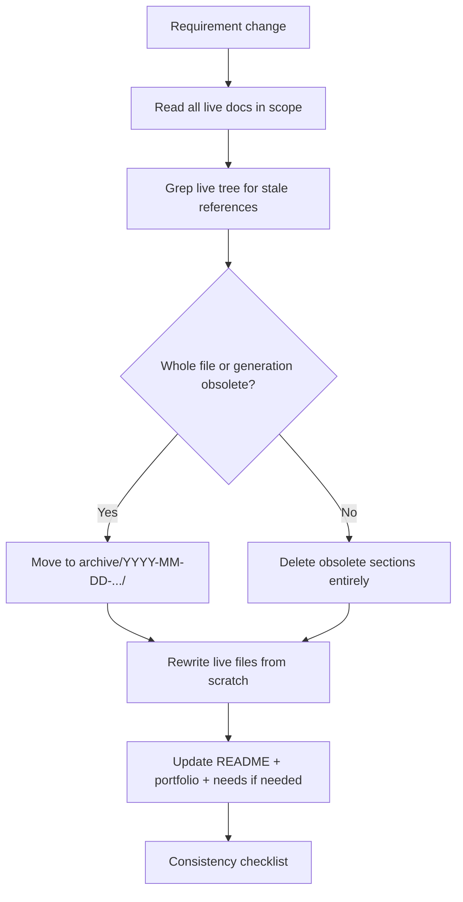

# Agent Guide — Cursor with Auto

Recommendations for maintaining **HomeProjects** when the primary editor is **Cursor with Auto**.

**Audience test:** Everything at the **repo root** (`needs/`, `architecture/`, `portfolio/`, `projects/`, `docs/`, `README.md`) must read as **one coherent spec** to a first-time external reader — no "see archive for the real answer," no contradictory pages, no WIP stubs.

---

## What works best in Cursor Auto

| Mechanism | Use for HomeProjects? | Why |
|-----------|----------------------|-----|
| **Project skill** (`.cursor/skills/home-projects/`) | **Yes — primary** | Domain facts + edit policy; Auto discovers via `description`. |
| **Project rule** (`.cursor/rules/home-projects.mdc`) | **Yes — thin always-on** | Consistency + archive policy every session. |
| **`docs/` markdown** | **Yes — source of truth** | Domain specs and standards; skills summarize and link here. |
| **Custom Cursor Agent** | Optional | Named chat preset; duplicate of skill if you want it. |
| **Global personal skill** | No | Household-specific — keep in this repo. |

---

## Core edit policy: read → archive → write from scratch

**Prefer rewriting live files over patching.** When a requirement changes (e.g. volume-only dial, discrete RGB colors):

1. **Read** — the full live surface area: `needs/`, `architecture/`, `portfolio/`, every affected `projects/*`, `docs/domain/*`, root `README.md`.
2. **Grep the live tree** (exclude `archive/`) for stale terms, old button names, wrong control models.
3. **Archive superseded live content** — move replaced files or whole generations into `archive/YYYY-MM-DD-vN-short-name/`. Archive **may grow**; add folders, don't rewrite old archive docs in place.
4. **Write from scratch** — replace affected live markdown files as complete documents. Avoid "add 10 lines here" that leaves contradictory sections above.
5. **Verify consistency** — walk the checklist below before finishing.



### Archive rules (clarified)

| Do | Don't |
|----|-------|
| **Add** new dated folders when superseding live content | **Edit** old archive files to match new specs (erases history) |
| Link to archive for **historical** option lists / old UX | Point live docs at archive as if it were current truth |
| Keep archive README index updated when adding folders | Leave orphaned files at repo root |

### When to archive vs rewrite in place

| Situation | Action |
|-----------|--------|
| Control model changes (remote, RGB) | Rewrite **all** live touchpoints; grep entire live tree |
| Replacing a whole project dossier | Move old live file(s) → `archive/…`; write new `projects/N/README.md` |
| Typos, embed one image | Small fix OK |
| "Deep dive" from v2 still linked | OK as **Historical** link — live README must still stand alone |

---

## Consistency checklist (run before every substantive change)

- [ ] **Root `README.md`** — table, costs, and links match live projects
- [ ] **`needs/`** — constraints and problem statements agree with change
- [ ] **`architecture/`** — rails/backbone agree (grep: Party, hue dial, 3 encoder, HSV 0-255)
- [ ] **`portfolio/`** — build order and cost table updated
- [ ] **Every `projects/*`** touched by the topic — rewritten or verified, not half-updated
- [ ] **`docs/domain/*`** — updated if domain facts changed
- [ ] **`.cursor/skills/` + `AGENTS.md`** — if policy or one-line facts changed
- [ ] **No live doc** says the opposite of another live doc
- [ ] **Images** embedded per [documentation-standards.md](./documentation-standards.md); legacy art labeled if UI changed
- [ ] **Archive** — superseded files moved out of root, not left alongside new spec

---

## Repository layout

```
HomeProjects/                 ← must be self-consistent (external audience)
├── README.md
├── needs/
├── architecture/
├── portfolio/
├── projects/01–06/
├── assets/
├── docs/
├── archive/                  ← grows over time; historical only
└── .cursor/
```

---

## When to update skill vs docs only

| Change | Update |
|--------|--------|
| Domain fact (RGB, remote buttons) | `docs/domain/*`, `needs/`, affected `projects/*`, **grep live tree**, skill summary |
| New archive generation | `archive/README.md` + move files |
| Typo / embed existing PNG | Target file only |
| Policy change (this doc) | `docs/agent-guide.md`, skill, rule, `AGENTS.md` |

---

## Domain pitfalls (live docs only)

- IR RGB: **discrete swatches** + **5 brightness levels** — [domain/rgb-lights.md](./domain/rgb-lights.md)
- Remote: **volume dial only**; **Sync Screens / ALL ON / GOODNIGHT** — [domain/unified-remote.md](./domain/unified-remote.md)
- No **Party Time** hardware button; no hue/saturation dials
- Wiring: GPIO table in `projects/05-unified-remote/wiring.md` beats diagram images
- PNG inventory: `assets/README.md` or `ls assets/` (glob may miss binaries)

---

## Optional: custom Cursor Agent

**Agents → New Agent** — paste [.cursor/skills/home-projects/SKILL.md](../.cursor/skills/home-projects/SKILL.md) plus: *"Follow read → archive → write from scratch. Root must stay consistent for a first-time reader."*

Name: **HomeProjects**.
