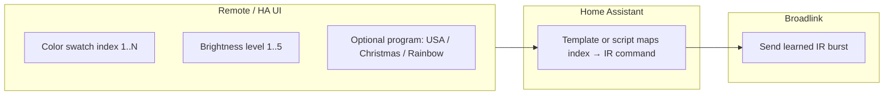

# Domain — IR RGB Accent Lights

The **3 IR-controlled accent light zones** are **not** addressable RGB (no 0–255 per channel). Home Assistant and the unified remote must model them as **discrete IR commands**, not `light.turn_on` with `rgb_color`.

---

## Actual behavior (per zone)

| Dimension | Model |
|-----------|--------|
| **Colors** | **8–20 fixed swatches** per controller — not a continuous hue ring |
| **Swatch families** | e.g. 3–4 blues, 2 reds, 3 purples, 1 warm white, 1 cool white (exact list varies per IR remote — **learn and enumerate per zone in HA**) |
| **Brightness** | **5 discrete levels** (not 0–100% slider) |
| **Programs / features** | Named presets on the IR remote — e.g. **USA**, **Christmas**, **Rainbow** (and similar — catalog per zone) |



---

## Implications for Home Assistant

- Store a **lookup table** per zone: `(color_index, brightness_level, program?) → Broadlink command name`.
- Expose as `input_select` or `script` — **not** as a dimmable `light` entity with HS wheel.
- Feedback is **open-loop** unless you add a power sensor or later swap to Zigbee/WLED.

**Example entity naming**

```
input_select.lr_rgb_color      # "Blue 2", "Warm White", ...
input_number.lr_rgb_brightness # 1–5
input_select.lr_rgb_program    # "Static", "USA", "Christmas", "Rainbow"
script.lr_rgb_apply            # sends IR for current selections
```

---

## Implications for the unified remote

- **No hue/saturation dials.**
- **Screen UI:** scrollable swatch list + brightness 1–5 + program row.
- Physical **up/down** or **encoder press-step** can move selection; do not imply analog dimming.

See [unified-remote.md](./unified-remote.md).

---

## Per-zone catalog (fill in during IR learning)

| Zone | Location | # swatches (est.) | Programs observed | Notes |
|------|----------|-------------------|-------------------|-------|
| Zone 1 | _TBD_ | 8–20 | USA, Christmas, Rainbow, … | |
| Zone 2 | _TBD_ | 8–20 | | |
| Zone 3 | _TBD_ | 8–20 | | |

_Update this table when Broadlink learning is done._
