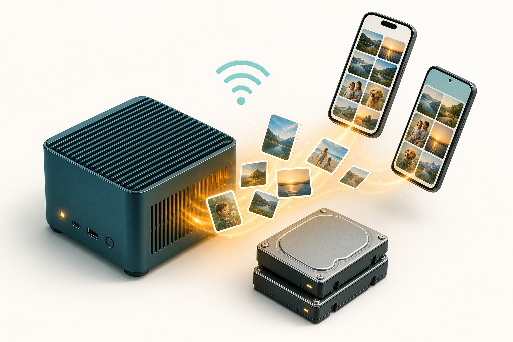

# 01 — Media & Photo Storage



**Problem:** [P1 — Media storage](../../needs/problems.md#p1--media--photo-storage)

## Recommended

**Immich on N100/TrueNAS + Tailscale**

| | |
|---|---|
| **Cost** | $500–1,100 (server + drives) |
| **Setup** | 1–2 days |
| **Maintenance** | Med |
| **Feasibility** | ★★★★★ |
| **Scalability** | ★★★★★ |

Native **iOS + Android** apps; background upload; partner sharing; no subscription. Optional Nextcloud for document sync. Optional B2 offsite (~$6/TB/mo).

## Alternates

| Option | When |
|--------|------|
| Synology + Synology Photos | Want appliance, less Docker |
| Immich on Proxmox VM | Colocate with Frigate + HA on one host |

## Data path

```
Phones (Immich app) → Tailscale → Immich + Postgres → ZFS pool
                              └→ optional restic → B2
```

## Deep dive

- Full option comparison: [archive v1](../../archive/2026-05-30-v1-exploratory-guides/docs/personal-media-storage.md)
- Full dossier: [archive v2 solutions-01](../../archive/2026-05-31-v2-home-systems-proposal/home-systems-proposal/solutions-01-media-storage.md)
