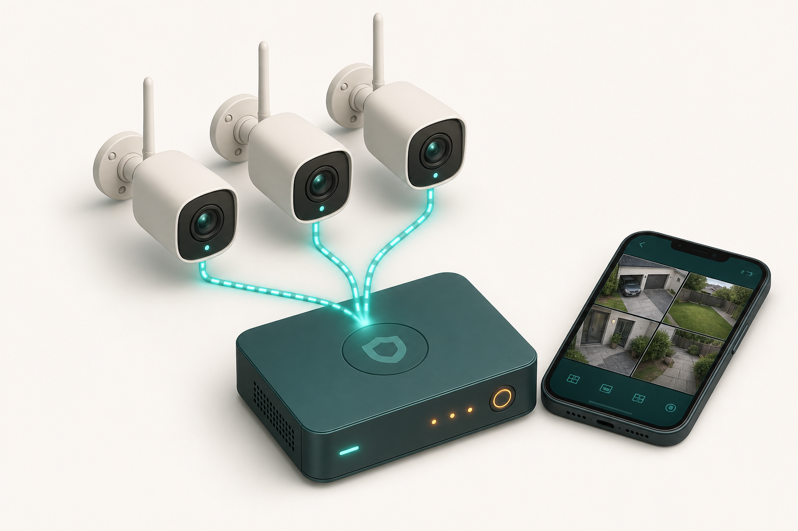

# 02 — Security Recording

**Problem:** [P2 — Security](../../needs/problems.md#p2--security-recording-23-cameras)

## Recommended

**Frigate on the shared N100 server + 2–3 Wi‑Fi RTSP cameras**

| | |
|---|---|
| **Cost** | $150–350 (cams; server shared with P1) |
| **Setup** | 0.5–1 day |
| **Maintenance** | Low–Med |
| **Feasibility** | ★★★★★ |
| **Scalability** | ★★★★ (add Coral at 4+ cams) |

Reolink/Amcrest Wi‑Fi, RTSP on, cloud off. Recordings on same pool as Immich. HA for alerts + Tailscale for remote.

## Alternates

| Option | When |
|--------|------|
| Reolink Home Hub | No homelab; want standalone |
| Blue Iris | Prefer Windows GUI |

## Storage rule of thumb

~2–6 GB/day per 1080p cam → **120–540 GB** for 30 days (3 cams).

## Deep dive

- [archive v1](../../archive/2026-05-30-v1-exploratory-guides/docs/home-security-recording.md)
- [archive v2 solutions-02](../../archive/2026-05-31-v2-home-systems-proposal/home-systems-proposal/solutions-02-security-recording.md)
