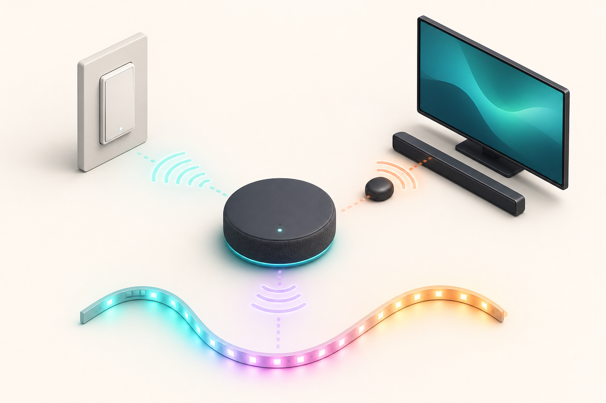

# 03 — Home Control (Lights, TV, Audio)



**Problem:** [P3 — Home control](../../needs/problems.md#p3--lights-tv-and-audio-control)

## Recommended

**Home Assistant + Lutron Caseta (ceilings) + Broadlink (IR) + Cast (TVs)**

| | |
|---|---|
| **Cost** | $350–700 |
| **Setup** | 1–3 days |
| **Maintenance** | Med |
| **Feasibility** | ★★★★★ |
| **Scalability** | ★★★★★ |

Three rails: [control-rails.md](../../architecture/control-rails.md).

### Lighting

- **Ceilings:** Caseta on/off (or Shelly behind switch) — physical paddle preserved
- **IR RGB zones:** Broadlink learns remotes; HA **lookup tables** for swatch + brightness 1–5 + programs — **not** `light.rgb` sliders

```mermaid
flowchart TD
  HA[Home Assistant] -->|Rail 3| CAS[Caseta on/off]
  HA -->|Rail 1| BL[Broadlink]
  BL -->|discrete IR| Z1[RGB zone 1]
  BL --> Z2[RGB zone 2]
  BL --> Z3[RGB zone 3]
  BL --> SAM[Samsung audio]
```

See [docs/domain/rgb-lights.md](../../docs/domain/rgb-lights.md).

### TV / audio

- **Living room:** `vizio` for TV; **Broadlink for Samsung volume/mute**
- **Bedroom:** Chromecast 4K via `cast`/`androidtv`
- **Macro:** "Watch TV" = TV on + Samsung on + input

### Stretch: commercials

- **Bedroom:** SmartTubeNext + SponsorBlock; ADB skip
- **Living room:** audio detector → IR mute (skip not practical on SmartCast)

## Deep dive

- [archive v1](../../archive/2026-05-30-v1-exploratory-guides/docs/home-assistant-integration.md)
- [archive v2 solutions-03](../../archive/2026-05-31-v2-home-systems-proposal/home-systems-proposal/solutions-03-home-control.md)

