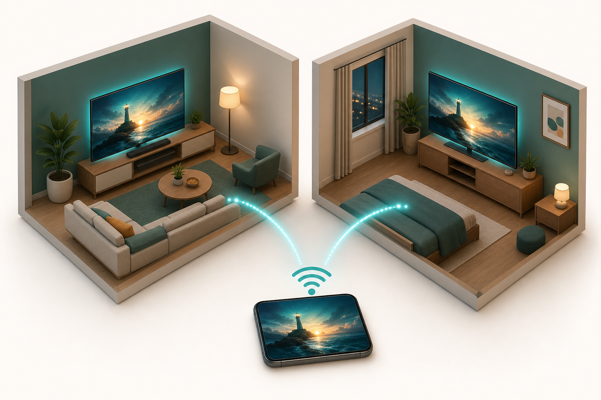

# 04 — Wireless Screen Share

**Problem:** [P4 — Screen share](../../needs/problems.md#p4--wireless-screen-share)

## Recommended

**Home Assistant + Google Cast on both Vizios** (config, not new hardware)

| | |
|---|---|
| **Cost** | $35–285 ($0 if HA + Cast already; +Broadlink for LR volume) |
| **Setup** | 2–4 hrs |
| **Maintenance** | Low |
| **Feasibility** | ★★★★★ |
| **Scalability** | ★★★★ |

Both TVs are already Cast targets. HA script `play_youtube_everywhere(url)` → both `media_player` entities. LR volume via Broadlink → Samsung.

## Honest limits

- No DRM tab mirror to many screens
- Netflix/Hulu: launch per TV, not one mirror
- 1–5 s sync drift between rooms OK

## Cross-state watch-together

- Owned media: **Jellyfin SyncPlay** over Tailscale
- YouTube: shared link + simultaneous HA trigger

## Deep dive

- [archive v1](../../archive/2026-05-30-v1-exploratory-guides/docs/screen-share-multiple-tvs.md)
- [archive v2 solutions-04](../../archive/2026-05-31-v2-home-systems-proposal/home-systems-proposal/solutions-04-screen-share.md)
