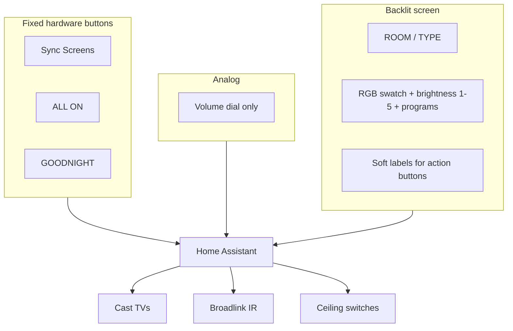

# 05 — Unified DIY Remote

**Problem:** [P5 — Unified remote](../../needs/problems.md#p5--unified-physical-remote)

**Domain spec:** [docs/domain/unified-remote.md](../../docs/domain/unified-remote.md)

## Recommended

**ESP32‑S3 + ESPHome** — screen-centric deck, **one volume dial**, fixed scene buttons.

| | |
|---|---|
| **Cost** | $45–90 (handheld) |
| **Setup** | 2–4 days |
| **Maintenance** | Low–Med (OTA, recharge) |
| **Feasibility** | ★★★★★ |
| **Scalability** | ★★★★★ |

### Interaction model

- **ROOM / TYPE:** Living/Bedroom · RGB / Ceiling
- **Volume dial:** audio only — not light color or brightness
- **RGB:** discrete swatches + 5 levels + programs on screen — [rgb-lights.md](../../docs/domain/rgb-lights.md)
- **Fixed buttons:** **Sync Screens**, **ALL ON**, **GOODNIGHT**
- **Other actions:** screen-labeled soft buttons (e.g. Cameras On, Watch TV)
- **Push-to-talk** → HA Assist

### Connectivity

Remote → **Wi-Fi → HA only** → Cast / Broadlink / switches. No BT; no on-remote IR.

### Feedback

Command ack (ESPHome API) + HA state on screen/LEDs; IR devices may show ⚠ assumed without power sensor.

## Sub-docs

| Doc | Content |
|-----|---------|
| [design.md](./design.md) | Layout, macros, BOM |
| [wiring.md](./wiring.md) | GPIO + wiring diagrams |
| [concepts.md](./concepts.md) | Form factors + image gallery |

## Archive

Pre-overhaul spec (3 dials, Party button): [archive v3](../../archive/2026-06-14-v3-remote-and-assets/unified-remote.md) — **historical only; not current UX.**
