# Unified Remote — Six Build Concepts

Six form factors for the same UX spec: [docs/domain/unified-remote.md](../../docs/domain/unified-remote.md).

| # | Form factor | Cost | Volume control | Best for |
|---|-------------|------|----------------|----------|
| 1 | [Pocket OLED](../../assets/collection-1-pocket.png) | ~$40 | 1× side wheel | First prototype / EDC |
| 2 | [Standard TFT ⭐](../../assets/collection-2-standard.png) | ~$62 | 1× encoder | **Daily driver** |
| 3 | [Mixer console](../../assets/collection-3-mixer.png) | ~$88 | 1× encoder | Desk / power user |
| 4 | [Thermostat puck](../../assets/collection-4-puck.png) | ~$57 | 1× ring dial | Side table |
| 5 | [Game grip](../../assets/collection-5-grip.png) | ~$71 | 1× thumb encoder | Couch |
| 6 | [Premium wood](../../assets/collection-6-wood.png) | ~$92 | 1× encoder | Showpiece |

⭐ Recommended path: prototype on **1**, build **2**, optionally re-shell as **6**.

All variants share: **screen-driven RGB** (discrete swatches + 5 brightness levels + programs), fixed **Sync Screens / ALL ON / GOODNIGHT**, and **soft-labeled action buttons**.

## Exploratory renders (20)

| | | |
|---|---|---|
|  |  | 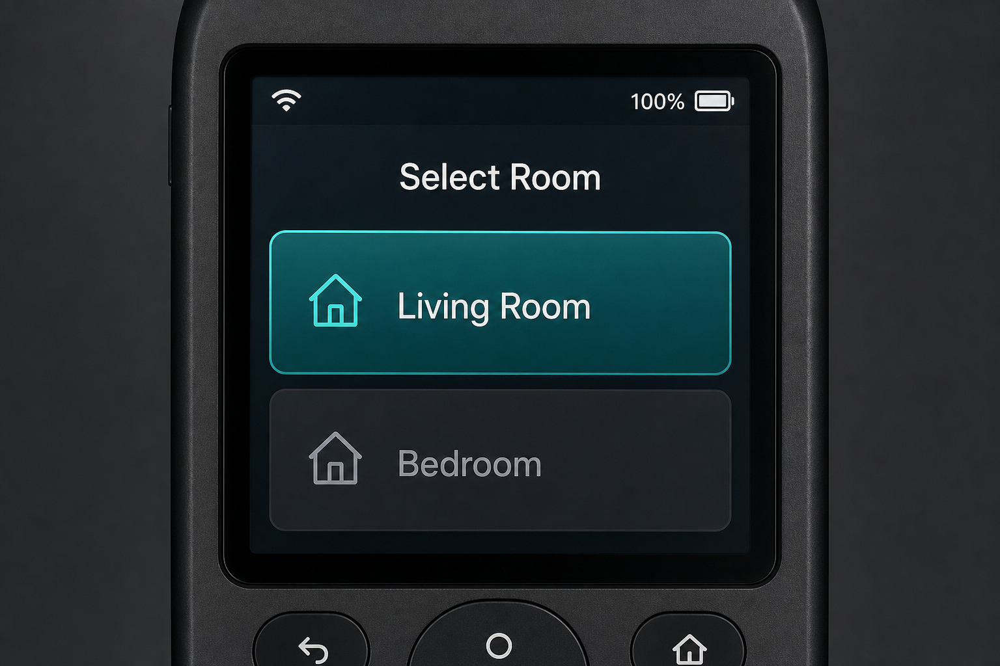 |
|  |  | 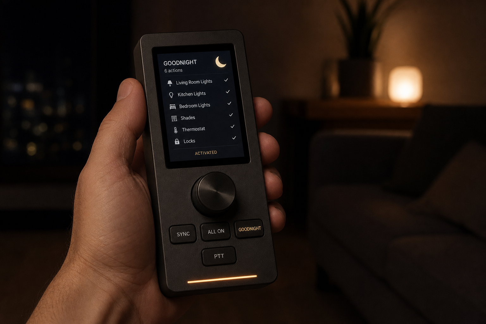 |
| 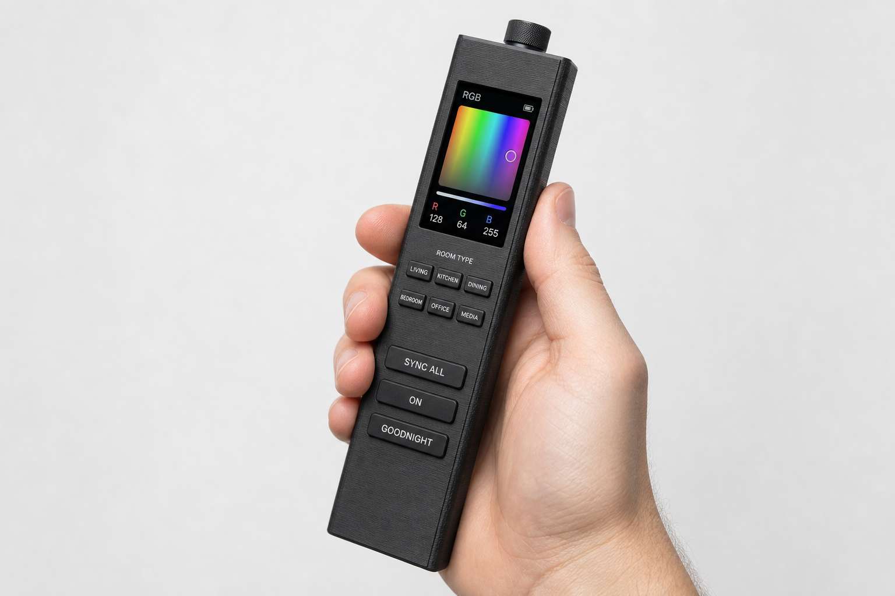 | 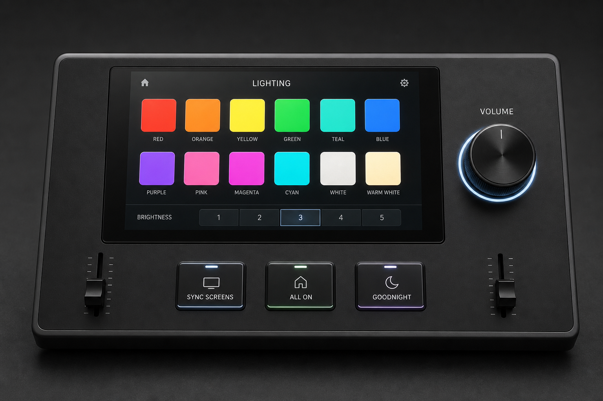 | 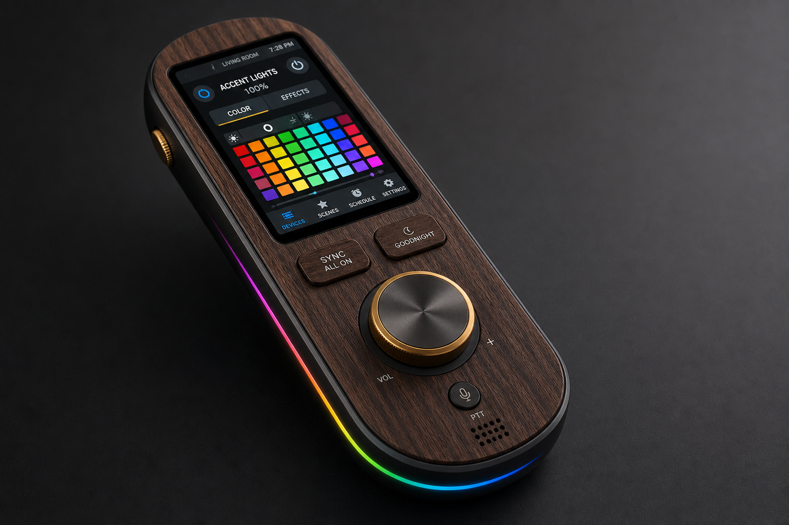 |
| 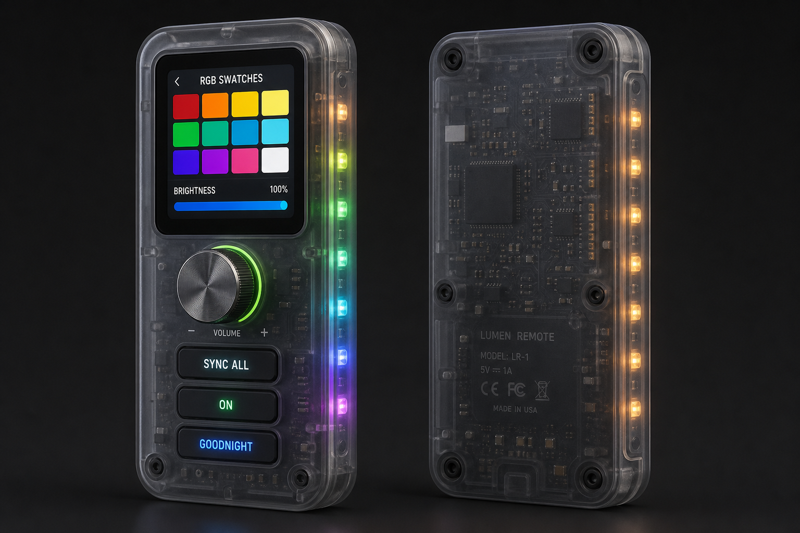 | 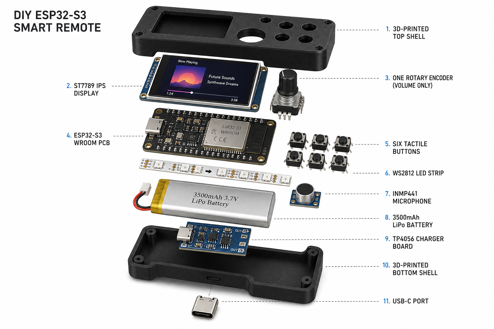 | 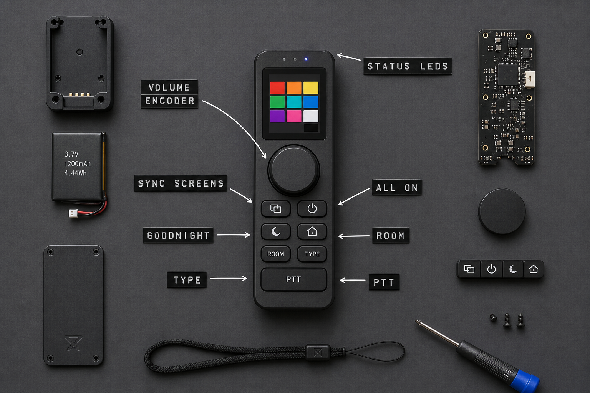 |
| 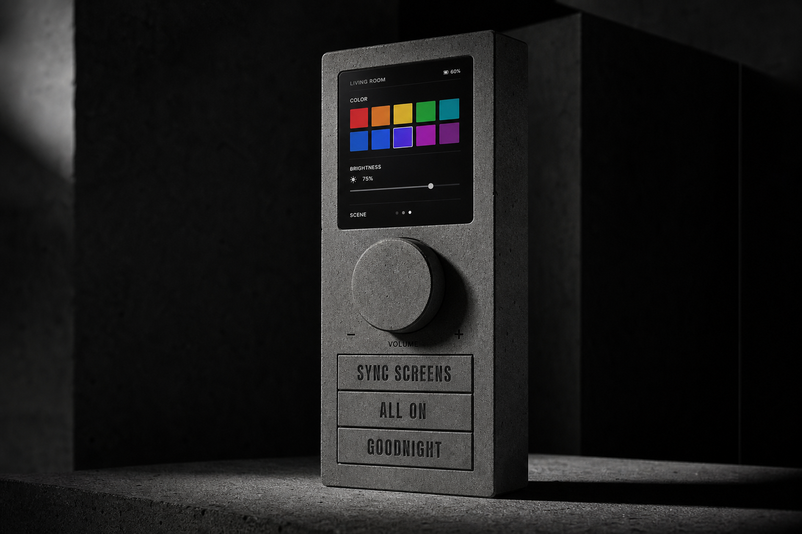 | 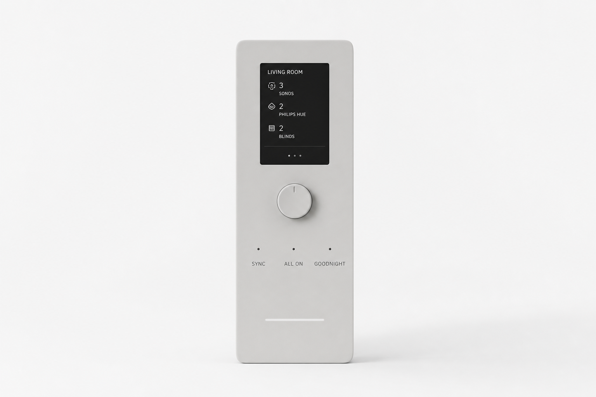 | 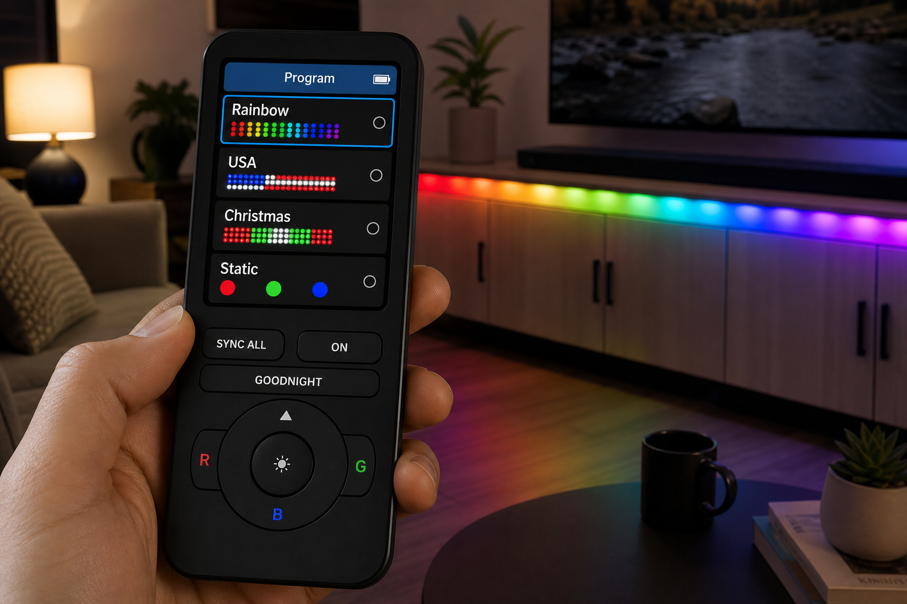 |
|  | 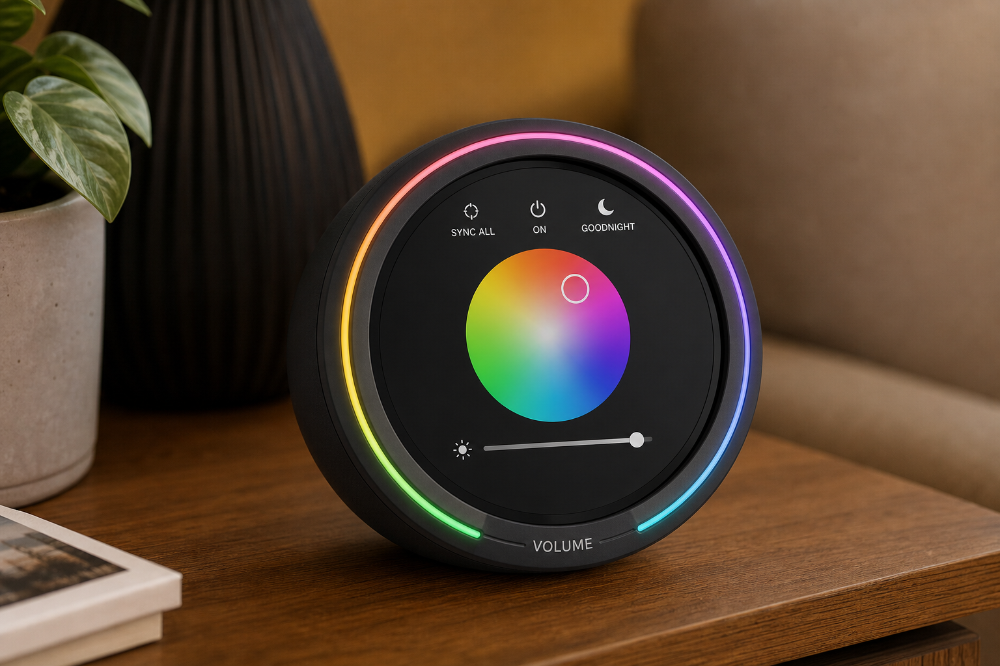 | 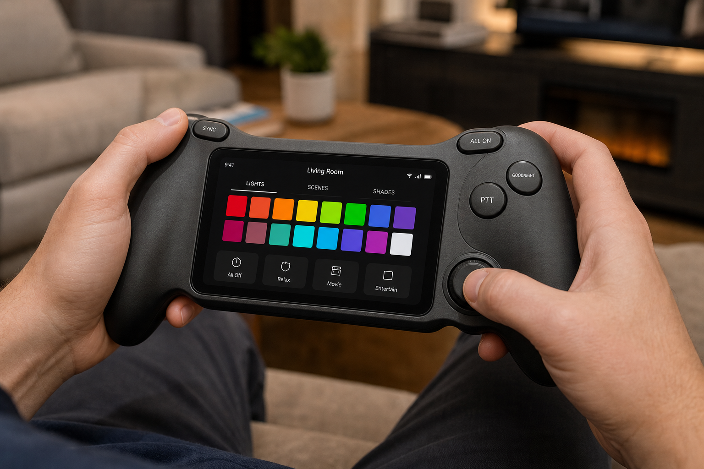 |
| 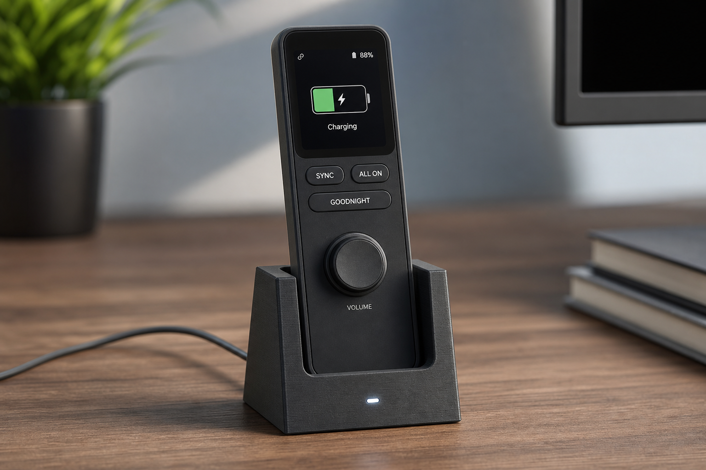 | 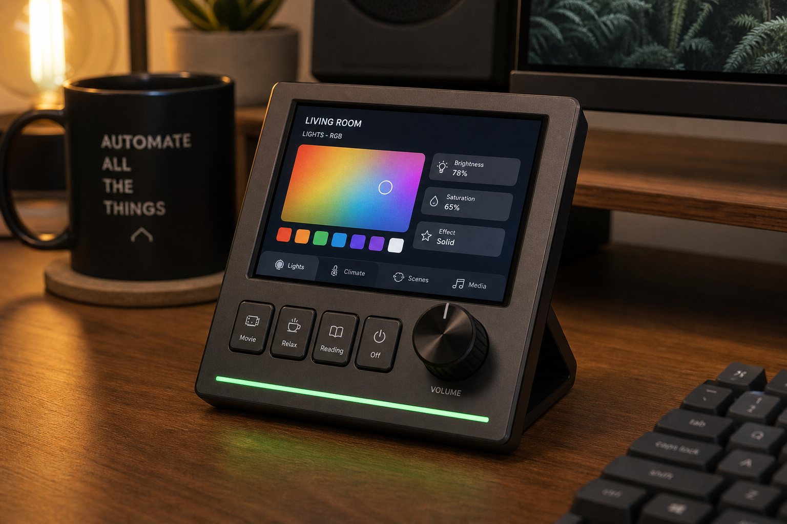 | |

Early front/layout/night concepts: `unified-remote-concept-front.png`, `unified-remote-concept-layout.png`, `unified-remote-concept-night.png`.

Prior art (3-dial / Party button): [archive v4 superseded assets](../../archive/2026-06-15-v4-superseded-remote-assets/).
