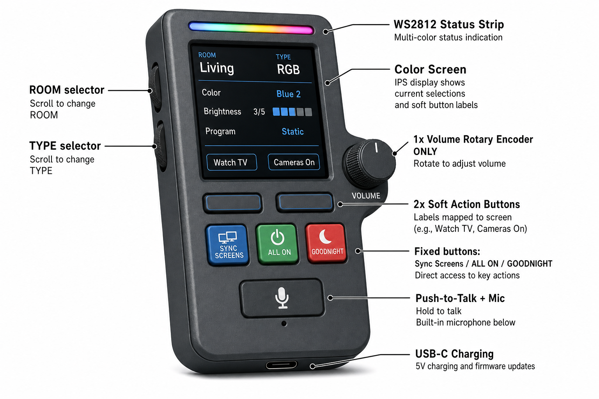
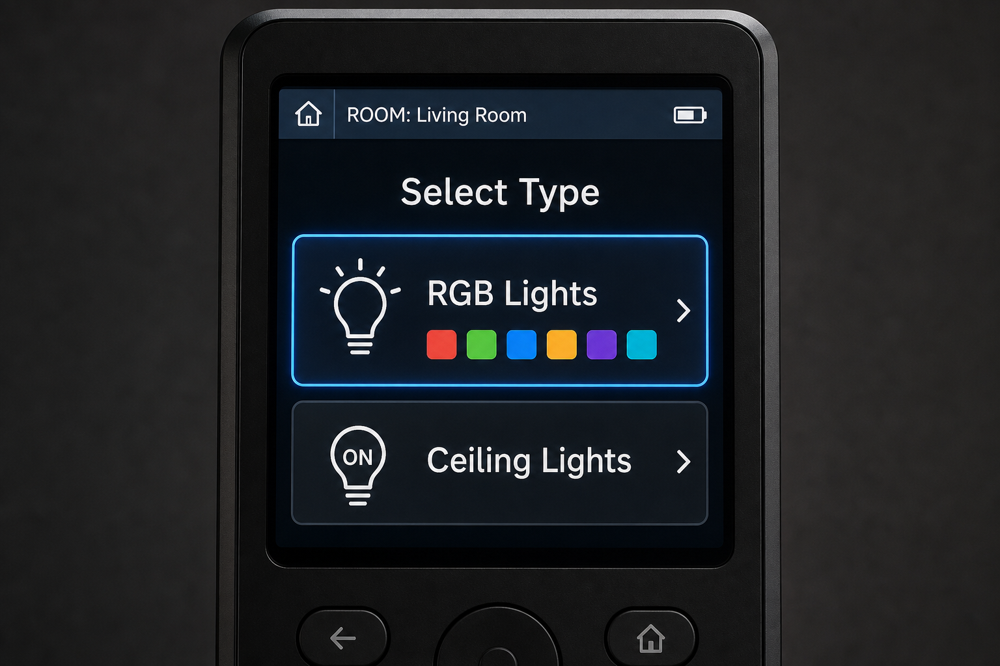
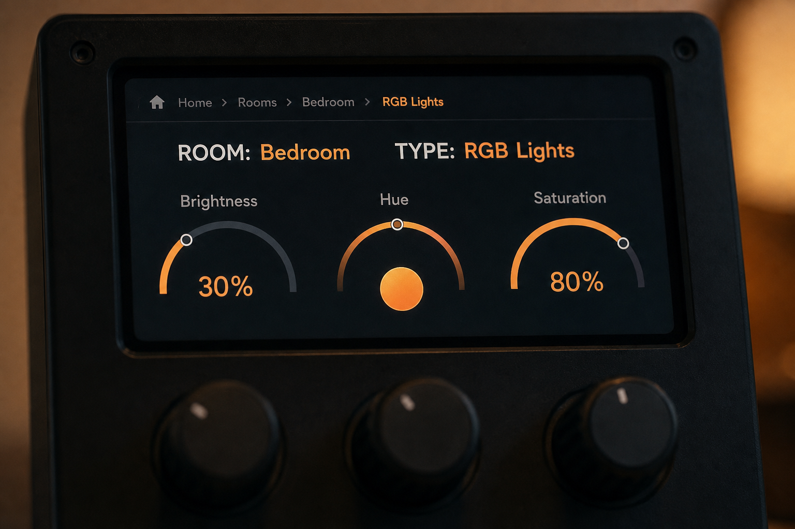
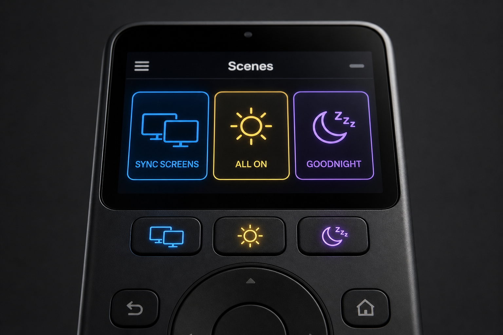

# Unified Remote — Design

> Authoritative UX spec: [docs/domain/unified-remote.md](../../docs/domain/unified-remote.md) · RGB model: [docs/domain/rgb-lights.md](../../docs/domain/rgb-lights.md)



---

## Control allocation

| Control | Role |
|---------|------|
| **Volume dial** | **Only analog dial** — audio volume (LR: Samsung via IR; BR: Cast/CEC) |
| **Sync Screens** | Fixed hardware button — cast same content to both TVs |
| **ALL ON** | Fixed hardware button — ceilings on + RGB to default/last state |
| **GOODNIGHT** | Fixed hardware button — lights/TVs off, optional cameras armed |
| **Action buttons (×2–4)** | Physical keys whose **label is drawn on the screen** (soft-mapped) |
| **ROOM / TYPE** | Select Living/Bedroom and RGB/Ceiling |
| **Screen (IPS)** | Context, RGB swatch picker, brightness 1–5, programs, soft labels, action log |
| **PTT + mic** | Voice → HA Assist |
| **Status LEDs** | Per-zone + command strip |

**Not used:** hue/saturation dials; dedicated **Party Time** button (use RGB program picker on screen instead).

---

## RGB on screen (discrete — not HSV)

IR strips expose **8–20 named swatches**, **5 brightness steps**, and programs (**USA**, **Christmas**, **Rainbow**). The UI steps through indices — it does not send 0–255 RGB.

| UI element | Behavior |
|------------|----------|
| Color row | Prev/next swatch (e.g. "Blue 2", "Warm White") |
| Brightness | Levels **1–5** only |
| Program | Static / USA / Christmas / Rainbow |
| Apply | HA script → Broadlink IR code for `(zone, color, level, program)` |





*Note: older concept art may show analog hue arcs — treat as illustrative; implementation is discrete swatches.*

---

## Ceiling (TYPE: Ceiling)

On/off and fixture/group selection on **screen** + soft buttons — non-dimmable fixtures, no dial.

---

## Fixed macros

| Button | HA macro (example) |
|--------|----------------------|
| **Sync Screens** | `play_youtube_everywhere(url)` + LR Samsung volume preset |
| **ALL ON** | Ceilings on; RGB zone(s) to configured default |
| **GOODNIGHT** | Ceilings off; RGB off; TVs off; optional Frigate arm |



*Regenerate concept art when labels are updated to ALL ON / GOODNIGHT / Sync Screens.*

---

## Action log (feedback)

```
GOODNIGHT
  ✓ ceilings off
  ✓ RGB zones off
  ✓ cameras armed
  ⚠ Samsung audio (assumed)
```

---

## Status LEDs

| LED | Meaning |
|-----|---------|
| Command strip | dim · blue sent · green OK · red fail · amber offline |
| Per-zone | One per tracked entity; IR zones use power sensor when possible |

---

## BOM summary (~$58 standard build)

| Part | $ |
|------|---|
| ESP32‑S3 8MB PSRAM | 10 |
| 1.9" IPS ST7789 | 9 |
| **1× volume encoder** | 2 |
| Sync + ALL ON + GOODNIGHT + 2× soft action buttons | 6 |
| WS2812 (18–24 px) | 5 |
| INMP441 | 4 |
| LiPo 3500 mAh + charger | 14 |
| Enclosure + misc | 8 |

Night mode: dim screen + LEDs; deep sleep wake-on-interrupt.

Archive deep-dive (pre-overhaul): [archive v3 unified-remote.md](../../archive/2026-06-14-v3-remote-and-assets/unified-remote.md).
