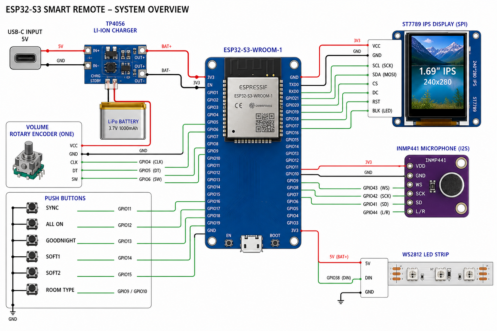
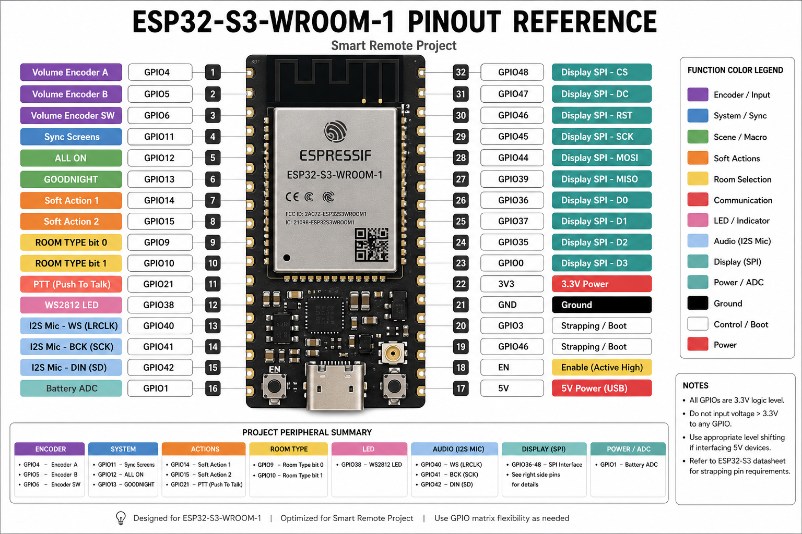

# Unified Remote — Wiring

> **Authoritative pin map** — trust this table for builds; wiring images match this map.  
> UX spec: [docs/domain/unified-remote.md](../../docs/domain/unified-remote.md)

**Hardware:** **1× volume encoder** + fixed scene buttons + screen-driven soft actions.

## GPIO pin map (ESP32‑S3‑WROOM‑1)

| Function | GPIO | Notes |
|----------|------|-------|
| **Volume encoder** | A / B / SW → 4 / 5 / 6 | Only rotary encoder |
| **Sync Screens** | 11 | pull-up |
| **ALL ON** | 12 | pull-up |
| **GOODNIGHT** | 13 | pull-up |
| **Soft action 1** | 14 | label on screen |
| **Soft action 2** | 15 | label on screen |
| **ROOM / TYPE** | 9 / 10 | |
| **Push-to-talk** | 21 | |
| **WS2812 DIN** | 38 | level-shift if noisy |
| **INMP441 I²S** | 40 / 41 / 42 | SEL→GND |
| **ST7789 SPI** | 36/35/34/33/47/48 | SCLK/MOSI/CS/DC/RST/BLK |
| **Battery ADC** | 1 | 2×100k divider |

*GPIO 7, 8, 16–18 available for expansion (touch, more soft buttons).*

Avoid strapping pins 0, 3, 45, 46 and USB 19/20.

## Logical diagram

```mermaid
flowchart LR
  ENC[Volume encoder] --> ESP[ESP32-S3]
  BTN[Sync / ALL ON / GOODNIGHT / soft ×2] --> ESP
  TFT[IPS display] --> ESP
  MIC[INMP441] --> ESP
  LED[WS2812] --> ESP
  ESP -->|Wi-Fi| HA[Home Assistant]
```

## Power

```
USB-C → TP4056 → LiPo 3.7V → 3.3V LDO → ESP32-S3
                    └→ ADC divider → GPIO1
```

## Wiring images









